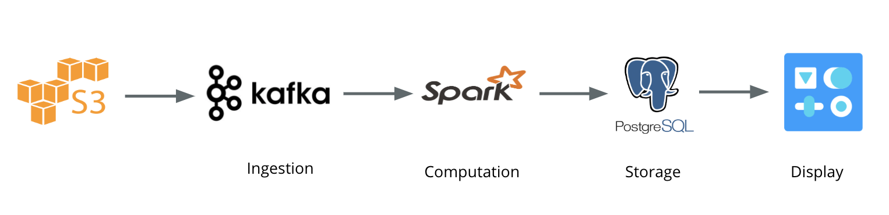

# Local Twitter Trends

## <a href="http://dataplatform.me/" rel="nofollow">Live Demo</a>

## 1. Introduction
This project is to:  
- Built a data platform to provide local Twitter trends and serve for ad monetization
- Developed a real-time tweet analysis pipeline using Kafka for ingesting, Spark Streaming for processing, PostgreSQL for result storage and Flask for visualization

## 2. Data Pipeline

